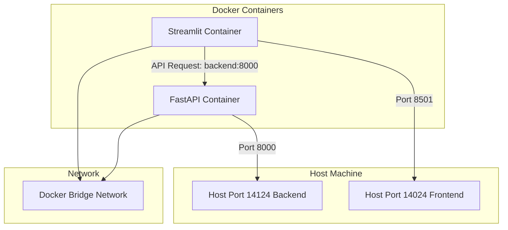

# fastapi-streamlit-template

Version. 0.1

自分が使う、あるいは身内が使う Web アプリを作りたい時のテンプレート。

frontend は streamlit で backend は fastapi。分けてるのは真面目に作り直したくなった時のため。

## 目的

クソアプリをサクッと作りたい時。特にデータビューア的なの。全部 Python。

ネットに公開する場合は Cloudflare Tunnel 通す。

## 機能

### 簡易的なログイン

簡易的なログインはやる。Cloudflare の Private でもいいけど面倒くさいので。

サインアップはない。

## 構成



## 使い方

### docker-compose を見直す

- ホストマシンの公開するポート番号を確認する
  - 14124 と 14024 を使う

### インストール

```
make up
```

停止

```
make down
```

クリーンアップ

```
make clean
```
# streamlit-fastapi-template
